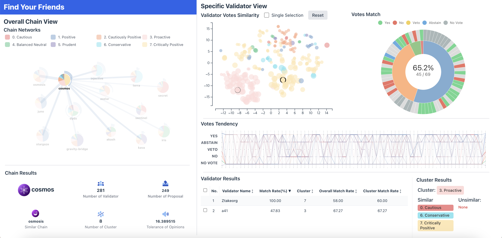

# Find Your Friends

In this project, we created a visualization tool that shows the relationship between validators within Proof-of-Stake (PoS) blockchain networks and allows them to explore similar validators.

### Background
- **Proof-of-Stake (PoS)**: The more assets you have, the more permission you have to validate your work in that chain

- **Validator**: The validator is delegated the cryptocurrency from people who have it to verify the transaction.

- **Staking**: Investment method that delegate the validator to use his or her cryptocurrency for blockchain validation and receives compensation

- **Proposal**: Important decisions within the chain are made by proposal voting.

Based on the proposal voting of validators, we tried to understand their tendencies and friendly relations.

### Result
The relationship between the validators and the tendency between the chains could be confirmed. Through this system, users can find validators similar to the validators they are investing in. 

However, there are many inconveniences in searching for validators, and additional interactions such as filtering functions are needed. Additional data analysis and processing are required.

### Role
- *Project Management*
- ***Project Design***
- ***Data Analysis***
- ***Data Preprocessing***
- *Design and Front-end Development Assistance*
- *Presentation*
